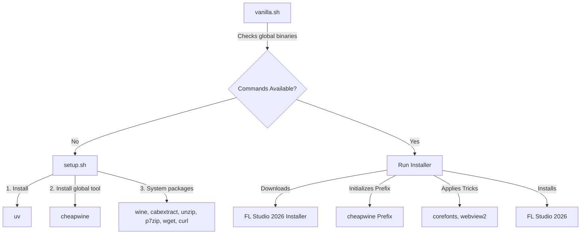

# 🍇 getfruity

A self-contained, zero-configuration, one-command installer for **FL Studio 2026** on Linux. Featuring full out-of-the-box integration with **FL Cloud** and the **Gopher AI Assistant**.

---

## 🚀 Overview

**getfruity** is designed to provide a perfect global installation of FL Studio on Linux systems. It installs **cheapwine** globally using `uv tool` and installs other system dependencies (`wine`, etc.) using your distribution's native package manager.

### ✨ Key Features

* **Seamless Unlock**: FL Studio can be unlocked directly from the browser in this installation.
* **Native System Integration**: After installation, FL Studio is available as a normal application on your host Linux system.
* **One-Command Install**: Just run `./vanilla.sh` and watch the environment configure itself.
* **Global CLI Tools**: Installs `cheapwine` globally using the `uv` tool manager.
* **FL Cloud Integration**: Full support for Image-Line's FL Cloud sounds, mastering, and cloud services.
* **Gopher AI Assistant**: Out-of-the-box support for the integrated AI assistant for smart music generation and workflow helpers.
* **Automatic Bootstrapping**: The script automatically detects missing packages and installs them using your system's package manager.

---

## 🛠️ How it Works

The project consists of two highly optimized shell scripts:



1. **[vanilla.sh](file:///home/heap/Documents/getfruity/vanilla.sh)**: The main entry point. It verifies if `cheapwine` and `wine` are installed globally. If any are missing, it calls `setup.sh` to install them, then proceeds with the FL Studio installation.
2. **[setup.sh](file:///home/heap/Documents/getfruity/setup.sh)**: The bootstrap manager. It installs `uv` if missing, installs `cheapwine` globally via `uv tool install`, and installs system dependencies via the native package manager (`apt`, `dnf`, `pacman`, or `brew`).

---

## 🏁 Getting Started

### 📋 Prerequisites

An active internet connection and `sudo` access (to allow your package manager to install `wine` and other system tools).

### 🏃 Quick Start

Simply clone this repository and run the entry point script:

```bash
chmod +x vanilla.sh setup.sh
./vanilla.sh
```

---

## 🔧 Under the Hood

### System Packages Installed
The bootstrapping script handles installing the following tools globally:
* **cheapwine**: Installed globally via `uv tool install cheapwine` (located in `~/.local/bin`)
* **wine**: The Windows compatibility layer
* **cabextract, unzip, p7zip**: Core archiving utilities needed by winetricks to install DLLs
* **wget, curl**: Networking utilities

---

## 🙏 Credits

* **Gemini**: For AI assistance and code generation.
* **DeepSeek**: For AI assistance and code generation.


