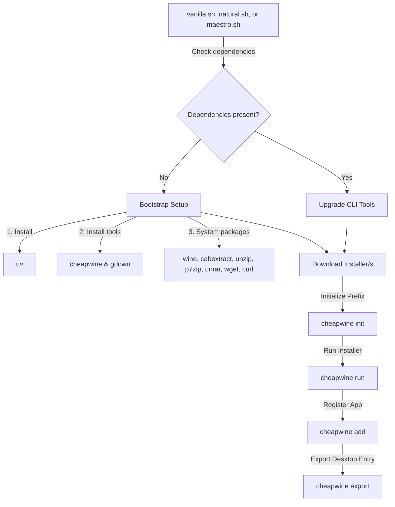

# 🍇 getfruity

A self-contained, zero-configuration, one-command installer for **FL Studio 2026** on Linux. Featuring full out-of-the-box integration with **FL Cloud** and the **Gopher AI Assistant**.

---

## 🚀 Overview

**getfruity** is designed to provide a perfect global installation of FL Studio on Linux systems. It installs **cheapwine** globally using `uv tool` and installs other system dependencies (`wine`, etc.) using your distribution's native package manager.

### ✨ Key Features

* **Seamless Unlock**: FL Studio can be unlocked directly from the browser in this installation.
* **Native System Integration**: After installation, FL Studio is available as a normal application on your host Linux system.
* **Multiple Flavors / One-Command Install**: Choose from three installer scripts: `./vanilla.sh` (standard), `./natural.sh` (includes Copycat), or `./maestro.sh` (includes Copycat + classic Edirol Orchestral VST).
* **Global CLI Tools**: Installs `cheapwine` and `gdown` globally using the `uv` tool manager.
* **FL Cloud Integration**: Full support for Image-Line's FL Cloud sounds, mastering, and cloud services.
* **Gopher AI Assistant**: Out-of-the-box support for the integrated AI assistant for smart music generation and workflow helpers.
* **Automatic Bootstrapping**: Automatically detects and installs all missing host and Wine environment dependencies (`uv`, `cheapwine`, `gdown`, `wine`, and utility packages).

---

## 🛠️ How it Works

The project is a single self-contained script:



**vanilla.sh**: The standard installer flavor. Bootstraps/upgrades `cheapwine` and system utilities, initializes the Wine prefix, installs FL Studio 2026, and exports it to the host desktop.

**natural.sh**: The natural installer flavor. In addition to standard bootstrapping/installation, it downloads and installs the **Copycat** plugin (which lets you create melodies with a microphone and your voice).

**maestro.sh**: The maestro installer flavor. In addition to the Copycat plugin and standard setup, it installs `gdown` and `unrar` to fetch and extract the classic **Edirol Orchestral VST**, and automatically applies a [registry/wrapper compatibility patch](https://github.com/HeapHeapHooray/edirol-orchestral-patch) so the VST runs flawlessly in FL Studio under Wine.

---

## 🏁 Getting Started

### 📋 Prerequisites

An active internet connection and `sudo` access (to allow your package manager to install `wine` and other system tools).

### 🏃 Quick Start

Simply clone this repository and run one of the installer scripts:

**Vanilla (Standard FL Studio 2026):**
```bash
chmod +x vanilla.sh
./vanilla.sh
```

**Natural (Includes the Copycat plugin for creating melodies via microphone/voice):**
```bash
chmod +x natural.sh
./natural.sh
```

**Maestro (Includes Copycat + classic [Edirol Orchestral VST patched](https://github.com/HeapHeapHooray/edirol-orchestral-patch) for Wine):**
```bash
chmod +x maestro.sh
./maestro.sh
```

---

## 🔧 Under the Hood

### Dependencies Installed
The bootstrapping logic handles installing the following tools globally:
* **cheapwine**: Installed globally via `uv tool install cheapwine` (located in `~/.local/bin`)
* **gdown**: Installed globally via `uv tool install gdown` (to download files from Google Drive)
* **wine**: The Windows compatibility layer
* **cabextract, unzip, p7zip, unrar**: Core archiving utilities needed to extract packages/DLLs
* **wget, curl**: Networking utilities

---

## 🙏 Credits

* **Gemini**: For AI assistance and code generation.
* **DeepSeek**: For AI assistance and code generation.


