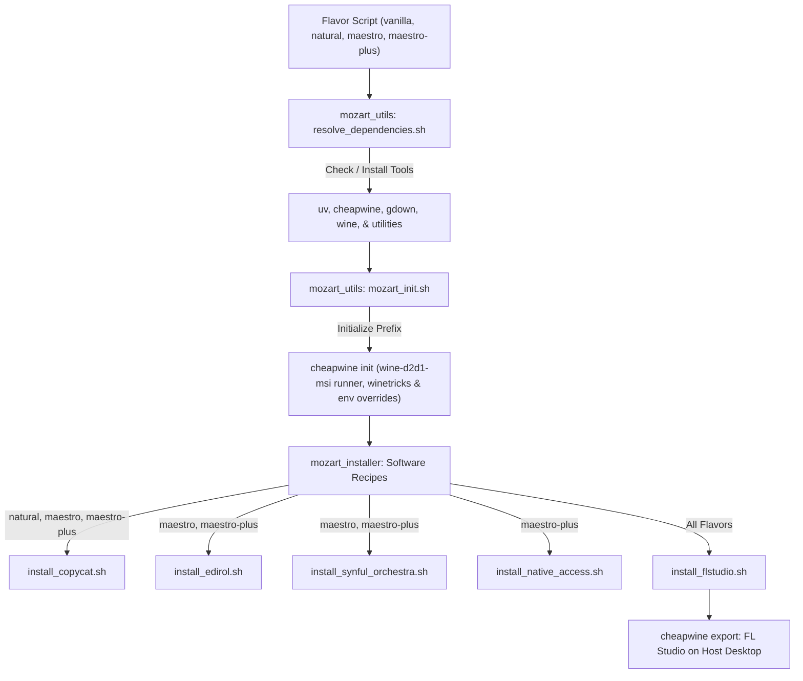

# 🍇 getfruity

A self-contained, zero-configuration, one-command installer for **FL Studio 2026** on Linux. Featuring full out-of-the-box integration with **FL Cloud** and the **Gopher AI Assistant**.

---

## 🚀 Overview

**getfruity** provides an automated, global installation of FL Studio on Linux systems. It delegates dependency resolution, Wine prefix initialization, and software provisioning to modular scripts from [**mozart_utils**](https://github.com/HeapHeapHooray/mozart_utils) and [**mozart_installer**](https://github.com/HeapHeapHooray/mozart_installer).

### ✨ Key Features

* **Modular Ecosystem**: Powered by [`mozart_utils`](https://github.com/HeapHeapHooray/mozart_utils) for environment setup and prefix configuration, and [`mozart_installer`](https://github.com/HeapHeapHooray/mozart_installer) for component installations (backed by [`mozart_downloader`](https://github.com/HeapHeapHooray/mozart_downloader) for reliable downloads).
* **Multiple Flavors / One-Command Install**: Choose from four lightweight installer scripts:
  * `./vanilla.sh` (standard FL Studio 2026)
  * `./natural.sh` (includes Copycat voice-to-melody plugin)
  * `./maestro.sh` (includes Copycat, Edirol Orchestral VST with compatibility patch, and Synful Orchestra)
  * `./maestro-plus.sh` (includes Copycat, Edirol Orchestral VST, Synful Orchestra, and Native Access with NTK Daemon)
* **Automatic Bootstrapping**: Detects missing host dependencies and installs `uv`, `cheapwine`, `gdown`, `wine`, and essential system tools across major package managers (`apt`, `dnf`, `pacman`, `brew`).
* **Optimized Wine Runner & Environment**: Uses `cheapwine` initialized with the `wine-d2d1-msi` runner, low-latency settings, custom DLL overrides, and winetricks (`renderer=vulkan`, `corefonts`, `webview2`, `vcrun2015`, `tahoma`, `nocrashdialog`, `powershell`).
* **Seamless Unlock**: FL Studio can be unlocked directly from the browser within this environment.
* **Native System Integration**: Installs and exports FL Studio and plugins as native desktop applications on your host Linux system.
* **FL Cloud Integration**: Full support for Image-Line's FL Cloud sounds, mastering, and cloud services.
* **Gopher AI Assistant**: Out-of-the-box support for the integrated AI assistant for smart music generation and workflow helpers.

---

## 🛠️ How it Works

The installer scripts serve as streamlined orchestrators that fetch and run tested recipes from the Mozart toolchain:


```mermaid
flowchart TD
    A["Flavor Script (vanilla, natural, maestro, maestro-plus)"] --> B["mozart_utils: resolve_dependencies.sh"]
    B -->|Check / Install Tools| C["uv, cheapwine, gdown, wine, & utilities"]
    C --> D["mozart_utils: mozart_init.sh"]
    D -->|Initialize Prefix| E["cheapwine init (wine-d2d1-msi runner, winetricks & env overrides)"]
    E --> F["mozart_installer: Software Recipes"]
    F -->|natural, maestro, maestro-plus| G["install_copycat.sh"]
    F -->|maestro, maestro-plus| H["install_edirol.sh"]
    F -->|maestro, maestro-plus| I["install_synful_orchestra.sh"]
    F -->|maestro-plus| J["install_native_access.sh"]
    F -->|All Flavors| K["install_flstudio.sh"]
    K --> L["cheapwine export: FL Studio on Host Desktop"]
```

### Flavor Breakdown

* **vanilla.sh**: Standard flavor. Calls `resolve_dependencies.sh` and `mozart_init.sh` from [`mozart_utils`](https://github.com/HeapHeapHooray/mozart_utils), then installs and exports FL Studio 2026 using `install_flstudio.sh` from [`mozart_installer`](https://github.com/HeapHeapHooray/mozart_installer).
* **natural.sh**: Natural flavor. Runs environment setup via `mozart_utils`, installs the **Copycat** plugin (melody creation via microphone/voice) via [`mozart_installer/install_copycat.sh`](https://github.com/HeapHeapHooray/mozart_installer), and installs FL Studio 2026.
* **maestro.sh**: Maestro flavor. Extends Natural flavor by installing **Synful Orchestra** ([`install_synful_orchestra.sh`](https://github.com/HeapHeapHooray/mozart_installer)) and extracting the classic **Edirol Orchestral VST** with an automatic [compatibility patch](https://github.com/HeapHeapHooray/edirol-orchestral-patch) ([`install_edirol.sh`](https://github.com/HeapHeapHooray/mozart_installer)) before installing FL Studio.
* **maestro-plus.sh**: Complete production suite. Includes everything in Maestro flavor plus automated setup for **Native Access** and the **NTK Daemon** background service ([`install_native_access.sh`](https://github.com/HeapHeapHooray/mozart_installer)) alongside FL Studio 2026.

---

## 🏁 Getting Started

### 📋 Prerequisites

An active internet connection and `sudo` access (to allow your system package manager to install `wine` and archiving dependencies if not already present).

### 🏃 Quick Start

Clone this repository and run your preferred flavor script:

**Vanilla (Standard FL Studio 2026):**
```bash
chmod +x vanilla.sh
./vanilla.sh
```

**Natural (Includes the Copycat plugin for creating melodies via microphone/voice):**
```bash
chmod +x natural.sh
./natural.sh
```

**Maestro (Includes Copycat + Synful Orchestra + patched [Edirol Orchestral VST](https://github.com/HeapHeapHooray/edirol-orchestral-patch)):**
```bash
chmod +x maestro.sh
./maestro.sh
```

**Maestro Plus (Includes Copycat + Synful Orchestra + Edirol Orchestral VST + Native Access):**
```bash
chmod +x maestro-plus.sh
./maestro-plus.sh
```

---

## 🔧 Under the Hood

### The Mozart Ecosystem

* **[mozart_utils](https://github.com/HeapHeapHooray/mozart_utils)**:
  * `resolve_dependencies.sh`: Bootstraps or upgrades CLI utilities (`uv`, `cheapwine`, `gdown`) and installs system packages across supported package managers (`wine`, `cabextract`, `unzip`, `7zip`, `p7zip-full`, `unrar`, `wget`, `curl`).
  * `mozart_init.sh`: Configures the `cheapwine` Wine prefix with optimal runner (`wine-d2d1-msi`), low-latency flags, DLL overrides (`d3d11`, `dxgi`, `d3d9`, `mfc140`, `msxml3`, `gdiplus`), Java scaling parameters, and winetricks (`renderer=vulkan`, `corefonts`, `webview2`, `vcrun2015`, `tahoma`, `nocrashdialog`, `powershell`).
* **[mozart_installer](https://github.com/HeapHeapHooray/mozart_installer)**:
  * `install_flstudio.sh`: Downloads FL Studio installer, performs silent installation, registers the application with `cheapwine add`, and exports desktop shortcuts with `cheapwine export`.
  * `install_copycat.sh`: Downloads and installs the Copycat voice-to-MIDI plugin.
  * `install_edirol.sh`: Downloads and sets up EDIROL Orchestral with Wine registry adjustments.
  * `install_synful_orchestra.sh`: Downloads and installs Synful Orchestra.
  * `install_native_access.sh`: Downloads and installs Native Access with the NTK Daemon service.
* **[mozart_downloader](https://github.com/HeapHeapHooray/mozart_downloader)**:
  * Provides robust download scripts utilized by installer modules to fetch binaries and archives.

### Dependencies Managed

* **cheapwine**: Managed via `uv tool install --no-cache cheapwine`
* **gdown**: Managed via `uv tool install --no-cache gdown`
* **wine**: Windows compatibility layer installed via native package manager
* **cabextract, unzip, 7zip, p7zip, unrar**: Archiving utilities for extracting installers and runtime assets
* **wget, curl**: Data transfer utilities

---

## 🙏 Credits

* **Gemini**: For AI assistance and code generation.
* **DeepSeek**: For AI assistance and code generation.
